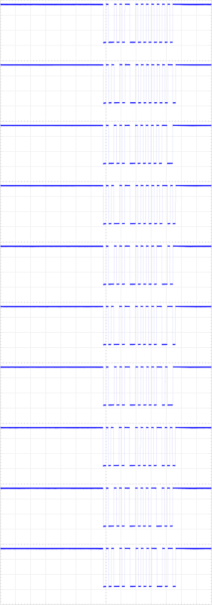
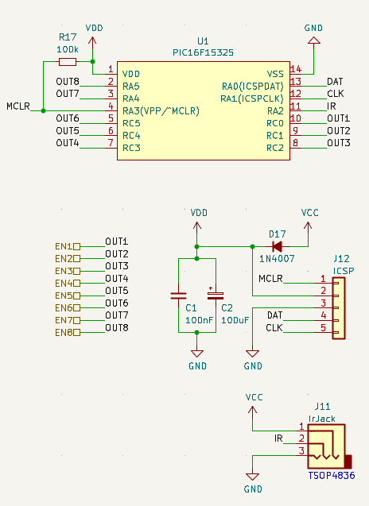
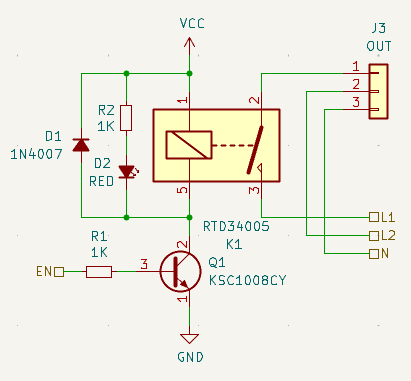
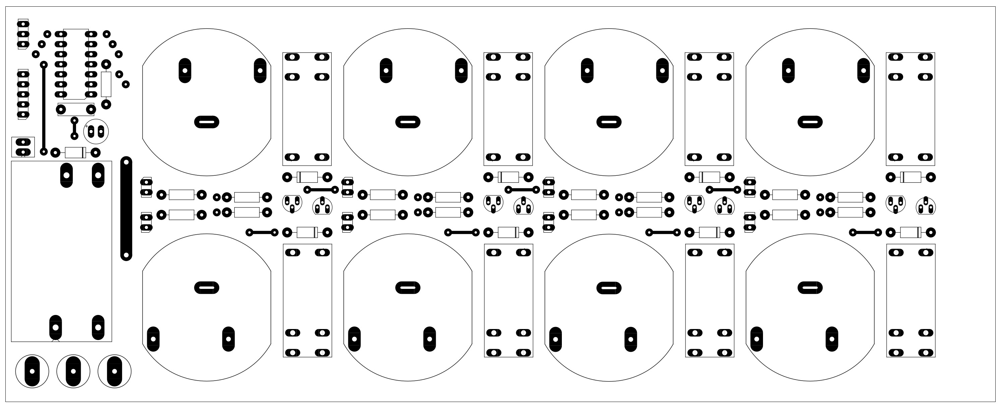
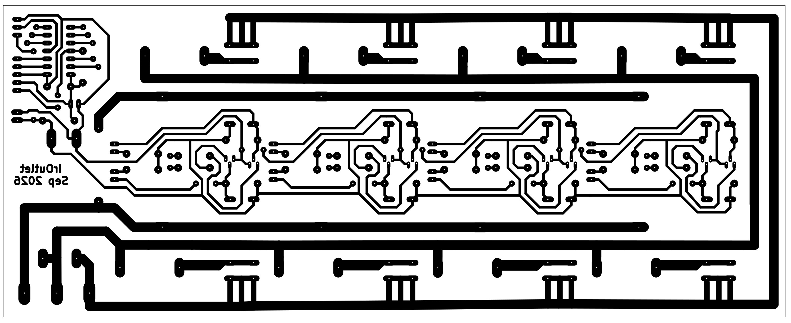
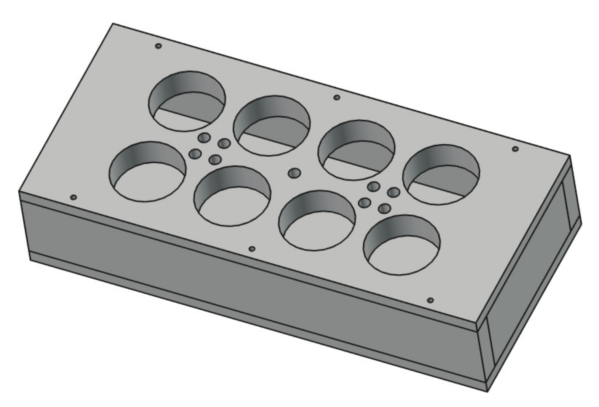

# IrOutlet
IrOutlet is an 8-port power outlet. Each power outlet can be switched on or off using an IR remote.

## Design details
A [TSOP4836](KiCad/doc/tsop4836.pdf) IR receiver converts the IR light into a bit stream. This bit stream is decoded by a [PIC16F15325](KiCad/doc/pic16f15325.pdf) microcontroller.
When the IR signal is decoded, the microcontroller performs an action if the signal matches a supported IR address/command listed below:

| Address | Command    | Action                 |
|---------|------------| -----------------------|
| `0b00101` | `0b00000000` | Switch all outlets on  |
| `0b00101` | `0b00000001` | Switch outlet 1 on     |
| `0b00101` | `0b00000010` | Switch outlet 2 on     |
| `0b00101` | `0b00000011` | Switch outlet 3 on     |
| `0b00101` | `0b00000100` | Switch outlet 4 on     |
| `0b00101` | `0b00000101` | Switch outlet 5 on     |
| `0b00101` | `0b00000110` | Switch outlet 6 on     |
| `0b00101` | `0b00000111` | Switch outlet 7 on     |
| `0b00101` | `0b00001000` | Switch outlet 8 on     |
| `0b00101` | `0b00001001` | Switch all outlets off |
| `0b00101` | `0b00100000` | Switch outlet 1 off    |
| `0b00101` | `0b00100001` | Switch outlet 2 off    |
| `0b00101` | `0b00110010` | Switch outlet 3 off    |
| `0b00101` | `0b00110101` | Switch outlet 4 off    |
| `0b00101` | `0b00110100` | Switch outlet 5 off    |
| `0b00101` | `0b00110110` | Switch outlet 6 off    |
| `0b00101` | `0b00101001` | Switch outlet 7 off    |
| `0b00101` | `0b00111110` | Switch outlet 8 off    |

## Notes

1. Address `0b00101` corresponds to the address of a Marantz remote control I had available.

2. Below are some oscilloscope captures measured at the output pin of the [TSOP4836](KiCad/doc/tsop4836.pdf) while using the Marantz remote control: 
  

## Development tree

The project consists of three major folders:

1. [Mplab](https://www.microchip.com/en-us/tools-resources/develop/mplab-x-ide)
  
  This folder contains the bare-metal code for the Microchip [PIC16F15325](KiCad/doc/pic16f15325.pdf) controller.
  [MPLAB X IDE](https://www.microchip.com/en-us/tools-resources/develop/mplab-x-ide) or [VSCode](https://code.visualstudio.com/) with the MPLAB extension can be used as the development environment (using the free [XC8](https://www.microchip.com/en-us/tools-resources/develop/mplab-xc-compilers/xc8) compiler).
  
  Major implementation files:
  - [rc5.h](Mplab/IrOutlet.X/rc5.h): RC5 decoder API
  - [rc5.c](Mplab/IrOutlet.X/rc5.c): RC5 decoder implementation
  - [interrupts.c](Mplab/IrOutlet.X/interrupts.c): [TSOP4836](KiCad/doc/tsop4836.pdf) and timer interrupt handlers
  - [main.c](Mplab/IrOutlet.X/main.c): Controller setup and IR handling

2. [KiCad](https://www.kicad.org)
    
    This folder contains the IrOutlet schematic and PCB design.

    - The schematic consists of two major parts:
      1. The controller: 
        
      2. The relay driver: 
        
    - The components are laid out on a single-sided PCB:
      1. Component layout: 
        
      2. Bottom mask: 
        
 
3. [FreeCAD](https://www.freecad.org)

    This folder contains the 3D enclosure model for the IrOutlet.
    
